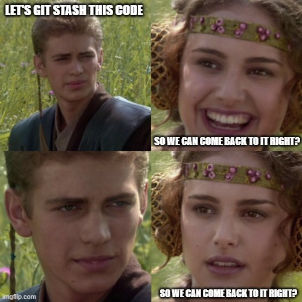
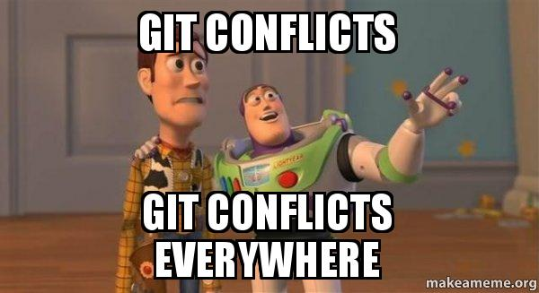
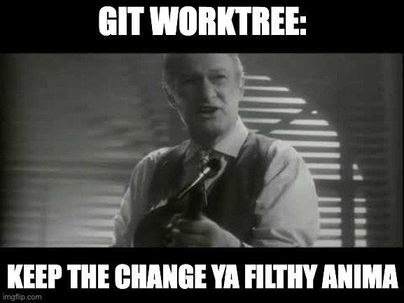

# Title

I don't want to spoiler, so let's keep the name hidden.

---

## The problem

Let's say you're working on a feature, and you have a branch `feat/a`.

----

- Your coworker asks you to check something on a branch or you started to review something and have to switch.
- What will you do? 
- Maybe stash your changes or create a dummy commit then checkout to the other branch.

----

- While this is fine, it can be somewhat annoying doing it all the time, and maybe even forgetting about it.

----

- And sometimes we can even mess up some things, and end up having:

---

## So, what else can we do?

----

----

## And what are those?

"A git repository can support multiple working trees, allowing you to check out more than one branch at a time."
